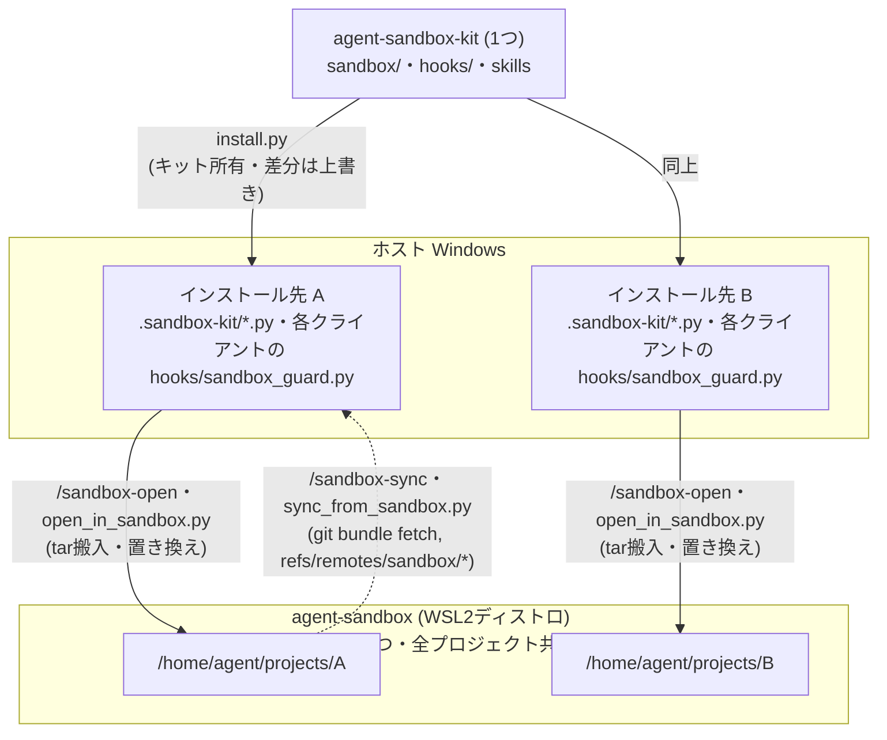

# エージェント用サンドボックス(WSL2 専用ディストロ)

[English](README.md)

AI エージェント(Claude Code / Codex CLI / Cursor / Antigravity)を、ホスト Windows から
分離した専用の WSL2 ディストロ内で動かすための一式。自動承認モードでエージェントを
走らせても、被害がディストロ内に閉じることを目的とする。

このディレクトリ(`.sandbox-kit/`)は agent-sandbox-kit の `install.py` によって
複数のプロジェクトへコピーされる(キット所有・差分はキット版で上書き)。ただし
操作対象の WSL2 ディストロ(`agent-sandbox`)は**マシンに1つの共用環境のまま**であり、
どのプロジェクトのコピーから `/sandbox-setup`(`setup_sandbox.py` のラッパー)を
実行しても同じディストロに冪等に作用する。プロジェクトごとに別ディストロが
作られるわけではない。

## スキル早見表

Claude Code・Codex CLI・Cursor・Antigravity からは各操作を Skill(`/sandbox-*`)経由で
呼ぶ。それ以外の環境では対応する `.sandbox-kit/*.py` を直接実行する。詳細な手順は各節を参照。

| Skill | 対応スクリプト | 用途 |
|---|---|---|
| `/sandbox-setup` | `setup_sandbox.py` | 初回セットアップ(ディストロ作成〜provisionまで・冪等) |
| `/sandbox-open` | `open_in_sandbox.py` | プロジェクトを tar 搬入して IDE を起動(既存コピーがあれば置き換え確認) |
| `/sandbox-open-vc` | `reopen_in_sandbox.py` | 搬入済みプロジェクトへ IDE を繋ぎ直すだけ(再搬入なし) |
| `/sandbox-sync` | `sync_from_sandbox.py` | ディストロ内 git 履歴を host の `refs/remotes/sandbox/*` へ取り込み(成果物回収) |
| `/sandbox-close` | `close_project_in_sandbox.py` | sync してからカレントプロジェクトだけを削除(ガード付き) |
| (Skill化なし) | `tools/destroy_sandbox.py` | ディストロ全体をガード付き破棄。**インストール先には配布されず agent-sandbox-kit リポジトリから実行する** |

いずれのスクリプトも `--dry-run`・`--force`・`--yes` 等のオプションを持つものがあり、
破壊的な操作(削除・破棄・置き換え)には確認プロンプトが入る。

## 全体像: キット / インストール先 / サンドボックスの関係

**agent-sandbox-kit は1つ、インストール先プロジェクトは複数、サンドボックスは
マシンに1つ**という非対称な関係になっている(サンドボックス内では
プロジェクトごとにサブディレクトリが分かれる)。



- **キット → インストール先**: `install.py` で複数プロジェクトにコピーされる。
  キット所有ファイル(本ディレクトリ一式・Skill・フック)は差分があれば
  キット側の内容で上書きされる。
- **インストール先 → サンドボックス**: `/sandbox-open`(`open_in_sandbox.py` の
  ラッパー)でプロジェクトをディストロ内 `/home/agent/projects/<名前>` へ tar 搬入
  する。**どのインストール先から実行しても同じ1つのディストロに作用する**
  (プロジェクトごとに別ディストロが作られるわけではない)。
- **サンドボックス → インストール先**: `/sandbox-sync`(`sync_from_sandbox.py` の
  ラッパー)でサンドボックス側プロジェクトの git 履歴を host 側リポジトリの
  `refs/remotes/sandbox/*` へ取り込む(下記「成果物の回収」参照)。

## 方式と分離の範囲

IDE の UI はホスト(Windows ネイティブ)のまま、**Remote-SSH 接続**
(wsl.exe 経由の ProxyCommand → ディストロ内 sshd の localhost:2222)で分離ディストロ内のプロジェクトを開く。
エージェント・シェル・ツールはすべてディストロ内で動く。

⚠️ VS Code 系 IDE の **WSL リモート拡張(`wsl+`)は使えない**: あの拡張は Windows 側の
拡張ディレクトリやサーバー tarball を `/mnt/c`(automount)経由で読む前提で
動くため、ホストドライブを unmount する分離ディストロでは必ず失敗する
(`Failed to translate 'c:\...'` → `wslServer.sh: not found`)。
このため接続は Remote-SSH で行う。鍵と `~/.ssh/config` の `Host agent-sandbox`
エントリは setup_sandbox.py が自動で用意する。

| 項目 | 状態 |
|---|---|
| ホストのドライブ (C:/D:) | **見えない**(automount 自体は有効だが、systemd ユニットが毎 boot 全ホストドライブを unmount) |
| Windows 実行ファイルの起動 | **できない**(`interop` 無効) |
| sudo / root | **エージェントには与えない**(sudo があると drvfs でホストドライブを再マウントでき分離が破れる) |
| `\\wsl.localhost` 共有 | **使える**(ホスト → ディストロ方向のみ。誤ってこのパスをホスト側のエージェントで開くと sandbox_guard が警告・ブロック) |
| ネットワーク | **制限なし**(API 呼び出し・npm install 等は素通し) |
| 二層目の防御 | Linux 上なので Claude Code / Codex 内蔵サンドボックスも有効化可 |

**限界**:

- ネットワークは全許可のため、認証情報をディストロ内に置く以上、その権限で
  できること(git push 等)はエージェントにもできる。渡すトークンは必要最小限
  の権限にすること。
- WSL2 の全ディストロは**1つの VM・カーネルを共有**している。カーネルレベルの
  脆弱性に対する強固な境界(Hyper-V VM 分離ほど)ではない。日常の暴走・誤操作
  対策と割り切ること。
- `\\wsl.localhost` 共有を担う plan9 サーバーは automount 設定に連動して起動する
  ため、automount は有効にしてあり、ホストドライブは boot 時の systemd ユニット
  (`sandbox-umount-host-drives`)で unmount している。boot 直後のごく短い間だけ
  ドライブがマウントされた状態が存在する(sshd より先に unmount が走るよう順序付け
  済み。上記「日常の暴走・誤操作対策」の範囲)。

## セットアップ(初回のみ)

```
/sandbox-setup                              # Skill 経由
python .sandbox-kit/setup_sandbox.py        # スクリプト直接実行
```

Ubuntu 24.04 rootfs のダウンロード → `agent-sandbox` ディストロの import →
分離設定(wsl.conf)→ provision(agent ユーザー / Node.js / claude / codex)まで
自動で行う。再実行すると設定と provision だけ再適用される(冪等)。

続けて認証を行う:

```
wsl -d agent-sandbox
$ claude          # 表示された URL をホストのブラウザに手動で貼る
$ codex login     # 同上
```

⚠️ interop 無効のためブラウザは自動で開かない。URL の手動コピーで進めること。

## 日常の使い方

```
/sandbox-open [プロジェクトのパス]                        # 省略時はカレントディレクトリ(Skill 経由)
python .sandbox-kit/open_in_sandbox.py [プロジェクトのパス] # スクリプト直接実行
```

1. プロジェクトが tar ストリーム経由でディストロ内
   `/home/agent/projects/<名前>` にコピーされる
   (`node_modules`・`.venv`・`__pycache__` は除外)
2. IDE が `ssh-remote+agent-sandbox` リモートで起動する
   (**Remote-SSH 拡張**が必要)
3. 初回は必要に応じてリモート側にエージェントの拡張(Claude Code 等)をインストールする
   (拡張ビューで「Install in SSH: agent-sandbox」)

### IDE の選択

起動する IDE は `--ide` または環境変数 `AGENT_SANDBOX_IDE` で選ぶ(既定は `code`)。

| `--ide` | 起動コマンド | IDE |
|---|---|---|
| `code` | `code` | VS Code |
| `cursor` | `cursor` | Cursor |
| `antigravity`(別名 `agy`) | `antigravity-ide` | Antigravity |

```
python .sandbox-kit/open_in_sandbox.py --ide cursor
setx AGENT_SANDBOX_IDE cursor        # 毎回指定しない場合(新しいシェルから有効)
```

いずれも `<コマンド> --remote ssh-remote+agent-sandbox <パス>` で起動する。
各 IDE に Remote-SSH 相当の拡張が入っていることが前提。

### 成果物の回収

- **`/sandbox-sync`(sync_from_sandbox.py)**: host 側から `wsl.exe` 経由でサンドボックス側の
  git 履歴を bundle として取得し、host 側リポジトリの `refs/remotes/sandbox/*`
  へ fetch する。origin リモートが無いローカル専用リポジトリでも使え、
  host の作業ツリー・現在のブランチには一切触れないため何度でも安全に
  再実行できる:

  ```
  /sandbox-sync                                   # カレントディレクトリ名の対応プロジェクトを取り込む(Skill 経由)
  python .sandbox-kit/sync_from_sandbox.py        # スクリプト直接実行
  git log sandbox/<branch>                        # 取り込んだブランチを確認
  git merge sandbox/<branch>                       # 必要ならマージ
  ```

- **git push**: origin リモート(GitHub 等)があるプロジェクトなら、
  ディストロ内から push し、ホスト側で pull してもよい
- **逆コピー**: `/sandbox-open --export <名前> <取り出し先>` または
  `python .sandbox-kit/open_in_sandbox.py --export <名前> <取り出し先>`
  (取り出し先ディレクトリは空である必要があり、git 管理外ファイルを含めた
  全体退避向け)
- **エクスプローラー**: `\\wsl.localhost\agent-sandbox\home\agent\projects` を
  ホストから直接参照できる(閲覧・個別ファイルの取り出し向け。この UNC パスを
  ホスト側のエージェントで開くと sandbox_guard が警告・ブロックする)

パッケージの追加(エージェントに sudo は無い)はホスト側から行う:

```
wsl -d agent-sandbox -u root -- apt-get install -y <パッケージ>
```

### IDE を閉じてしまった場合の再オープン

搬入済みのプロジェクトへ繋ぎ直すだけなら再搬入は不要:

```
/sandbox-open-vc                                # カレントディレクトリ名の対応プロジェクトを繋ぎ直す(Skill 経由)
python .sandbox-kit/reopen_in_sandbox.py        # スクリプト直接実行(--ide も指定可)
```

内部では `<IDE> --remote ssh-remote+agent-sandbox /home/agent/projects/<名前>` を
実行しているだけで、既存コピーの中身には一切触れない。

`/sandbox-open`(`open_in_sandbox.py`)を再実行してもよいが、既存コピーがある
場合は「置き換えますか?」の確認が出る(`N`/Enter で中断すれば中身は消えない)。
確認なしで繋ぎ直したいだけなら上記の reopen 系を使うほうが早い。

⚠️ 再搬入は既存コピーを**丸ごと置き換える**(rm -rf + コピー)ため、
ディストロ内の未 push 作業が消える。置き換える前に `/sandbox-sync` で回収すること。

ディストロ自体が止まっている場合は先に `wsl -d agent-sandbox` で起こしておく
(systemd 有効なので以後は動き続ける)。

## プロジェクトを閉じる(1プロジェクトだけ削除)

作業が終わったプロジェクトを、ディストロ全体は破棄せずに1つだけ片付けたい場合は
`/sandbox-close`(`close_project_in_sandbox.py` のラッパー)を使う:

```
/sandbox-close                                          # カレントディレクトリ名の対応プロジェクトを閉じる(Skill 経由)
python .sandbox-kit/close_project_in_sandbox.py         # スクリプト直接実行
```

1. `/sandbox-sync`(sync_from_sandbox.py)と同じ経路で git 履歴を
   `refs/remotes/sandbox/*` へ回収する(回収に失敗すると既定では中止する。
   回収不要と分かっている場合のみ `--force` で続行)
2. host 側の作業ツリーに未コミットの変更があれば警告する(この変更は
   回収されず削除で失われる)
3. 削除前にプロジェクト名の入力による最終確認がある(スクリプト実行時は `--yes`)
4. `/home/agent/projects/<名前>` だけを削除する。ディストロ自体
   (agent-sandbox)や他プロジェクトには一切触れない

⚠️ 破壊的操作のため、エージェント経由(auto モード等)で実行する場合でも、
Skill 側の指示により実行前に必ずチャット上でユーザーへの確認が入る
(詳細は `sandbox-close` の SKILL.md 参照)。

対象がカレントプロジェクト1つに限られるため、他の `sandbox-*` Skill
(sandbox-open・sandbox-sync 等)と同様にインストール先プロジェクトへも配布される。
一方 `tools/destroy_sandbox.py`(ディストロ全体の破棄)はマシン共用のディストロ
そのものを操作する破壊的なスクリプトのため、意図せず配布されて誤操作の
入口が増えないよう、agent-sandbox-kit リポジトリからのみ実行する。

## 注意点・ハマりポイント

- **ディストロ内から `code .` は使えない**(interop 無効)。IDE への接続は
  必ずホスト側から行う(`code --remote ssh-remote+agent-sandbox <パス>` または
  Remote Explorer の SSH ターゲット)。
- **WSL リモート拡張(`wsl+`)は分離設定と非互換**(automount 前提)。
  誤って「WSL: agent-sandbox で開く」を選ぶと
  「VS Code Server for WSL closed unexpectedly」で失敗する。Remote-SSH を使うこと。
- **WSL はクライアント(wsl.exe)が全て終了すると約 15 秒でディストロを停止する**
  (systemd 有効でも同じ。sshd も止まる)。このため `~/.ssh/config` のエントリは
  localhost:2222 へ直接ではなく `ProxyCommand wsl.exe -d agent-sandbox ... nc localhost 2222`
  経由で繋ぐ。接続のたびにディストロが起動し、接続中は停止しない。
  旧版の setup_sandbox.py で作ったエントリ(ProxyCommand なし)だと、停止中は
  `Connection refused` や接続途中の `closed by remote host` になる。
  open_in_sandbox.py / reopen_in_sandbox.py(と setup_sandbox.py)は IDE 起動前に
  ProxyCommand を自動で追記する。
- **wsl.exe の出力は UTF-16LE**。スクリプトから叩くときは `WSL_UTF8=1` を付ける
  (本ディレクトリのスクリプトは対応済み)。
- **改行コード**: Windows からコピーしたファイルは CRLF のまま。気になる場合は
  ディストロ内で `git config core.autocrlf input` を設定する。
- **Antigravity**: スタンドアロン CLI のインストール手順が未確認のため
  provision.sh はプレースホルダーのみ(手順判明後に追記)。VS Code 系 IDE の
  ため、IDE 側の Remote-SSH 接続で本ディストロに繋ぐ運用は可能。
- **`/sandbox-sync`(sync_from_sandbox.py)は書き込み範囲が `refs/remotes/sandbox/*` に限られる**
  安全設計(host の作業ツリー・現在のブランチには触れない)。取り込んだ後の
  マージ・破棄は通常の git 操作として host 側で行うこと。

## 二層目: Claude Code 内蔵サンドボックスの併用

ディストロは Linux なので、Claude Code の OS レベルサンドボックス
(bubblewrap ベース)が使える。ディストロ内プロジェクトの
`.claude/settings.json` に以下を足すと、Bash 実行がさらに閉じ込められる:

```json
{
  "sandbox": { "enabled": true }
}
```

## ホスト側ガード: 誤ってホスト側で開いたときの警告・ブロック

サンドボックス内のフォルダを**ホスト側の** IDE / エージェントで直接開くと
(SSHFS マウントや `\\wsl.localhost` 経由)、エージェントがホスト Windows の
権限で動いてしまい隔離が無意味になる。これを検知するフックを、`install.py` が
**インストール先プロジェクトにのみ**配置する(ユーザーグローバル設定には入れない)。

| クライアント | 実体 | 登録先 | 動作 |
|---|---|---|---|
| Claude Code | `.claude/hooks/sandbox_guard.py` | `.claude/settings.json`(SessionStart / UserPromptSubmit) | 開始時に警告、プロンプト送信を**ブロック** |
| Codex CLI | `.codex/hooks/sandbox_guard.py` | `.codex/hooks.json`(SessionStart / UserPromptSubmit) | 開始時に警告、プロンプト送信を**ブロック** |
| Cursor | `.cursor/hooks/sandbox_guard.py` | `.cursor/hooks.json`(sessionStart / beforeSubmitPrompt) | 開始時にエージェントへ警告、プロンプト送信を**ブロック** |
| Antigravity | `.agents/hooks/sandbox_guard.py` | `.agents/hooks.json`(PreInvocation / PreToolUse) | モデル呼び出し前に警告を差し込み、**全ツール実行を拒否**(プロンプト送信をブロックするイベントが無いため) |

- 検知ロジックは各フックディレクトリの `_sandbox_guard_core.py`(全クライアント共通)
- プロジェクトはフックごと tar でサンドボックスへ搬入されるため、搬入後の
  コピーを誤ってホスト側で開いた場合もフックが効く
- 検知方法: ① `\\wsl.localhost\agent-sandbox` / `\\wsl$\...` パス、
  ② SSHFS-Win の UNC(`\\sshfs\agent@localhost!2222` 等)とドライブ割り当て、
  ③ マーカーファイル `.agent-sandbox` の祖先探索(provision.sh がディストロ内に
  root 所有 + immutable で配置。マウント方法によらず効く)
- 警告だけにしたい場合は、各登録先からブロック側のイベント
  (Claude Code / Codex: `UserPromptSubmit`、Cursor: `beforeSubmitPrompt`、
  Antigravity: `PreToolUse`)のエントリを削除する
- **Windows 以外では何もしない**: Remote-SSH で正しく開いた場合はディストロ内の
  エージェントがフックを実行するが、Linux 上なので即終了する(誤検知しない)
- マーカー検知は provision 再実行(`/sandbox-setup`・`setup_sandbox.py`)後に有効。
  UNC / SSHFS パターン検知はそれ以前でも効く

クライアントごとの注意:

- **Codex CLI**: プロジェクトのフックは `.codex/` 層が trusted のときだけ読まれ、
  フック定義ごとに `/hooks` で承認が要る(定義が変わると再承認)。
  `.codex/hooks.json` にはフックの絶対パスが書き込まれるため、マシン間で共有しない。
- **Cursor**: `.cursor/hooks.json` は trusted workspace でのみ実行される。
  また Cursor は互換のため `.claude/skills/` と Claude Code のフックも読み込むので、
  Claude Code と Cursor の両方を有効にしたプロジェクトでは Skill の重複表示や
  フックの二重実行が起きることがある。その場合は `install.py --clients` で片方に絞る。
- **Antigravity**: `.agents/hooks.json` にはフックの絶対パスが書き込まれるため、
  マシン間で共有しない。

⚠️ **サンドボックスが無いときはガードされない**: このフックは
「サンドボックス搬入済みのプロジェクトを誤ってホスト側で開いた」ケースだけを
検知するものであり、サンドボックスそのものをセットアップしていない・
使っていない通常のプロジェクトフォルダでは `is_sandbox_path`(検知条件: 上記①〜③の
いずれか)が常に False になり、フックは即 return して警告もブロックも一切発生しない。
つまり「サンドボックス機能を使っていない環境」を保護する仕組みではなく、
自動承認モードのエージェントに対する唯一の防御線はサンドボックス自体
(隔離された WSL2 ディストロ)であり、このガードはその隔離を誤って迂回した
場合の事後検知に過ぎない。

## ファイル構成

```
.sandbox-kit/
├── README.md              ← 英語版
├── README.ja.md           ← このファイル
├── setup_sandbox.py       ← 初回セットアップ(冪等・再実行可)
├── provision.sh           ← ディストロ内プロビジョニング(setup から自動実行)
├── wsl.conf               ← 分離設定テンプレート(/etc/wsl.conf に配置される)
├── open_in_sandbox.py     ← プロジェクト搬入・取り出し(--export)+ IDE 起動
├── sync_from_sandbox.py   ← 成果物回収(git bundle fetch → refs/remotes/sandbox/*)
├── reopen_in_sandbox.py   ← 搬入済みプロジェクトへ IDE を繋ぎ直すだけ(再搬入なし)
└── close_project_in_sandbox.py ← sync してから1プロジェクトだけ削除(ガード付き)
```

## ディストロの破棄・作り直し

⚠️ ディストロは**全プロジェクト共有**。素の `wsl --unregister` は確認なしで
即座に消え、`/home/agent/projects` 配下すべての未 push 作業と認証状態が
一緒に失われる。破棄は必ずガード付きスクリプトで行うこと:

```
python <agent-sandbox-kit>/tools/destroy_sandbox.py                        # git 状態を確認してから破棄
python <agent-sandbox-kit>/tools/destroy_sandbox.py --export-first <退避先>  # 全プロジェクトを退避してから破棄
/sandbox-setup                                                            # 再作成(認証は再度必要)
python .sandbox-kit/setup_sandbox.py                                      # スクリプト直接実行
```

- 未コミット / 未 push / git 管理外のプロジェクトが1つでもあれば一覧を出して
  拒否する(push で回収してから再実行が推奨。承知のうえの強行は `--force`)
- 実行前にディストロ名の入力による最終確認がある(スクリプト実行時は `--yes`)
- 運用の原則: **ディストロは使い捨ての計算環境、永続化は git push のみ**。
  この原則を守っていれば破棄はいつでも安全

**特定プロジェクトだけ壊れた・作り直したい・片付けたい場合は破棄不要**:
成果物を回収してから安全に削除したいなら `/sandbox-close`
(前述「プロジェクトを閉じる」参照)を使う。回収が不要で単に作り直すだけなら
直接 `rm -rf` でもよい:

```
wsl -d agent-sandbox -- rm -rf /home/agent/projects/<名前>
/sandbox-open <プロジェクトのパス>                         # 再搬入(Skill 経由)
python .sandbox-kit/open_in_sandbox.py <プロジェクトのパス> # スクリプト直接実行
```
