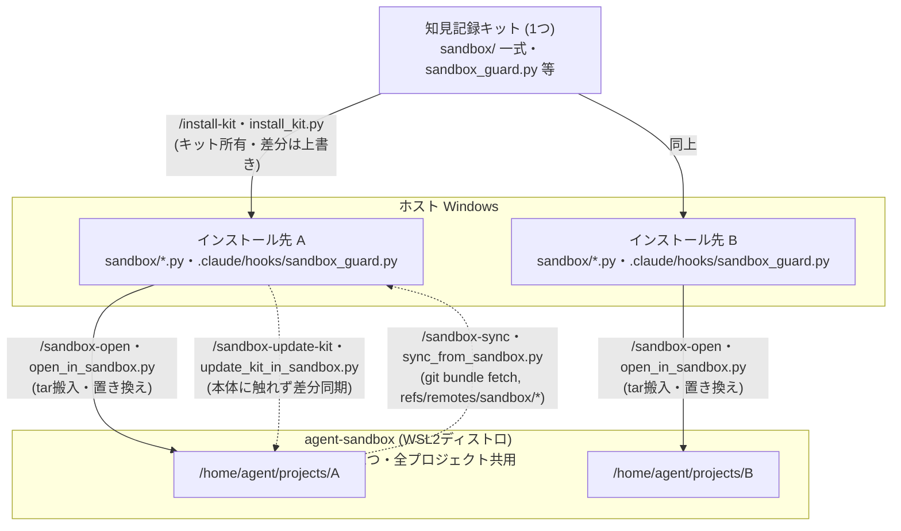

# エージェント用サンドボックス(WSL2 専用ディストロ)

AI エージェント(Claude Code / Codex CLI 等)を、ホスト Windows から分離した
専用の WSL2 ディストロ内で動かすための一式。自動承認モードでエージェントを
走らせても、被害がディストロ内に閉じることを目的とする。

このディレクトリ自体は知見記録キットの管理下にあり、`/install-kit`・
`install_kit.py` によって複数のプロジェクトへコピーされる(キット所有・差分は
キット版で上書き)。ただし操作対象の WSL2 ディストロ(`agent-sandbox`)は
**マシンに1つの共用環境のまま**であり、どのプロジェクトのコピーから
`/sandbox-setup`(`setup_sandbox.py` のラッパー)を実行しても同じディストロに
冪等に作用する。プロジェクトごとに別ディストロが作られるわけではない。

## 全体像: キット / インストール先 / サンドボックスの関係

**知見記録キットは1つ、インストール先プロジェクトは複数、サンドボックスは
マシンに1つ**という非対称な関係になっている(サンドボックス内では
プロジェクトごとにサブディレクトリが分かれる)。



- **キット → インストール先**: `/install-kit` / `install_kit.py` で複数プロジェクトに
  コピーされる。キット所有ファイル(本ディレクトリ一式など)は差分があれば
  キット側の内容で上書きされる。
- **インストール先 → サンドボックス**: `/sandbox-open`(`open_in_sandbox.py` の
  ラッパー)でプロジェクトをディストロ内 `/home/agent/projects/<名前>` へ tar 搬入
  する。**どのインストール先から実行しても同じ1つのディストロに作用する**
  (プロジェクトごとに別ディストロが作られるわけではない)。
- **差分同期**: キット更新後に再搬入(置き換え)せず反映したい場合は
  `/sandbox-update-kit`(`update_kit_in_sandbox.py` のラッパー)を使う
  (下記「キット更新の反映」参照)。
- **サンドボックス → インストール先**: `/sandbox-sync`(`sync_from_sandbox.py` の
  ラッパー)でサンドボックス側プロジェクトの git 履歴を host 側リポジトリの
  `refs/remotes/sandbox/*` へ取り込む(下記「成果物の回収」参照)。

## 方式と分離の範囲

VS Code の UI はホスト(Windows ネイティブ)のまま、**Remote-SSH 接続**
(localhost:2222 → ディストロ内 sshd)で分離ディストロ内のプロジェクトを開く。
エージェント・シェル・ツールはすべてディストロ内で動く。

⚠️ VS Code の **WSL リモート拡張(`wsl+`)は使えない**: あの拡張は Windows 側の
拡張ディレクトリやサーバー tarball を `/mnt/c`(automount)経由で読む前提で
動くため、ホストドライブを unmount する分離ディストロでは必ず失敗する
(`Failed to translate 'c:\...'` → `wslServer.sh: not found`)。
このため接続は Remote-SSH で行う。鍵と `~/.ssh/config` の `Host agent-sandbox`
エントリは setup_sandbox.py が自動で用意する。

| 項目 | 状態 |
|---|---|
| ホストのドライブ (C:/D:) | **見えない**(automount 自体は有効だが、systemd ユニットが毎 boot 全ホストドライブを unmount) |
| Windows 実行ファイルの起動 | **できない**(`interop` 無効) |
| sudo / root | **エージェントには与えない**(sudo があると drvfs でホストドライブを再マウントでき分離が破れる) |
| `\\wsl.localhost` 共有 | **使える**(ホスト → ディストロ方向のみ。誤ってこのパスをホスト側 Claude Code で開くと sandbox_guard がブロック) |
| ネットワーク | **制限なし**(API 呼び出し・npm install 等は素通し) |
| 二層目の防御 | Linux 上なので Claude Code / Codex 内蔵サンドボックスも有効化可 |

**限界**:

- ネットワークは全許可のため、認証情報をディストロ内に置く以上、その権限で
  できること(git push 等)はエージェントにもできる。渡すトークンは必要最小限
  の権限にすること。
- WSL2 の全ディストロは**1つの VM・カーネルを共有**している。カーネルレベルの
  脆弱性に対する強固な境界(Hyper-V VM 分離ほど)ではない。日常の暴走・誤操作
  対策と割り切ること。
- `\\wsl.localhost` 共有を担う plan9 サーバーは automount 設定に連動して起動する
  ため、automount は有効にしてあり、ホストドライブは boot 時の systemd ユニット
  (`sandbox-umount-host-drives`)で unmount している。boot 直後のごく短い間だけ
  ドライブがマウントされた状態が存在する(sshd より先に unmount が走るよう順序付け
  済み。上記「日常の暴走・誤操作対策」の範囲)。

## セットアップ(初回のみ)

```
/sandbox-setup                              # Claude Code
python sandbox/setup_sandbox.py             # スクリプト直接実行(Claude Code 以外)
```

Ubuntu 24.04 rootfs のダウンロード → `agent-sandbox` ディストロの import →
分離設定(wsl.conf)→ provision(agent ユーザー / Node.js / claude / codex)まで
自動で行う。再実行すると設定と provision だけ再適用される(冪等)。

続けて認証を行う:

```
wsl -d agent-sandbox
$ claude          # 表示された URL をホストのブラウザに手動で貼る
$ codex login     # 同上
```

⚠️ interop 無効のためブラウザは自動で開かない。URL の手動コピーで進めること。

## 日常の使い方

```
/sandbox-open [プロジェクトのパス]                        # 省略時はカレントディレクトリ(Claude Code)
python sandbox/open_in_sandbox.py [プロジェクトのパス]     # スクリプト直接実行(Claude Code 以外)
```

1. プロジェクトが tar ストリーム経由でディストロ内
   `/home/agent/projects/<名前>` にコピーされる
   (`node_modules`・`.venv`・`__pycache__` は除外)
2. VS Code が `ssh-remote+agent-sandbox` リモートで起動する
   (**Remote-SSH 拡張** `ms-vscode-remote.remote-ssh` が必要)
3. 初回はリモート側に **Claude Code 拡張をインストール**する
   (拡張ビューで「Install in SSH: agent-sandbox」)

成果物の回収:

- **`/sandbox-sync`(sync_from_sandbox.py)**: host 側から `wsl.exe` 経由でサンドボックス側の
  git 履歴を bundle として取得し、host 側リポジトリの `refs/remotes/sandbox/*`
  へ fetch する。origin リモートが無いローカル専用リポジトリでも使え、
  host の作業ツリー・現在のブランチには一切触れないため何度でも安全に
  再実行できる:

  ```
  /sandbox-sync                                   # カレントディレクトリ名の対応プロジェクトを取り込む(Claude Code)
  python sandbox/sync_from_sandbox.py             # スクリプト直接実行(Claude Code 以外)
  git log sandbox/<branch>                        # 取り込んだブランチを確認
  git merge sandbox/<branch>                       # 必要ならマージ
  ```

- **git push**: origin リモート(GitHub 等)があるプロジェクトなら、
  ディストロ内から push し、ホスト側で pull してもよい
- **逆コピー**: `/sandbox-open --export <名前> <取り出し先>` または
  `python sandbox/open_in_sandbox.py --export <名前> <取り出し先>`
  (取り出し先ディレクトリは空である必要があり、git 管理外ファイルを含めた
  全体退避向け)
- **エクスプローラー**: `\\wsl.localhost\agent-sandbox\home\agent\projects` を
  ホストから直接参照できる(閲覧・個別ファイルの取り出し向け。この UNC パスを
  ホスト側の Claude Code で開くと sandbox_guard がブロックする)

パッケージの追加(エージェントに sudo は無い)はホスト側から行う:

```
wsl -d agent-sandbox -u root -- apt-get install -y <パッケージ>
```

### VS Code を閉じてしまった場合の再オープン

搬入済みのプロジェクトへ繋ぎ直すだけなら再搬入は不要:

```
/sandbox-open-vc                                # カレントディレクトリ名の対応プロジェクトを繋ぎ直す(Claude Code)
python sandbox/reopen_in_sandbox.py             # スクリプト直接実行(Claude Code 以外)
```

内部では `code --remote ssh-remote+agent-sandbox /home/agent/projects/<名前>` を
実行しているだけで、既存コピーの中身には一切触れない。

`/sandbox-open`(`open_in_sandbox.py`)を再実行してもよいが、既存コピーがある
場合は「置き換えますか?」の確認が出る(`N`/Enter で中断すれば中身は消えない)。
確認なしで繋ぎ直したいだけなら上記の reopen 系を使うほうが早い。

ディストロ自体が止まっている場合は先に `wsl -d agent-sandbox` で起こしておく
(systemd 有効なので以後は動き続ける)。

## キット更新の反映(再搬入はしない)

⚠️ `/sandbox-open`(open_in_sandbox.py)の再搬入は既存プロジェクトを**丸ごと置き換える**
(rm -rf + コピー)ため、知見記録キットの更新をディストロ内のコピーへ反映する
手段に使わないこと。エージェントの未 push 作業が消える。更新はプロジェクト
本体に触れない専用スクリプトで行う:

**インストール先プロジェクト**(このスクリプトが `/install-kit` で配置された先)の
カレントディレクトリで実行する。install_kit.py は移植先には存在しないため、
サンドボックス側で再インストールを実行するのではなく、カレントの
キット管理ファイルをサンドボックス側コピーへ直接同期する。プロジェクト名の
指定や `--all` はできない(同期元がカレント固定のため、別名を受け付けると
無関係なプロジェクトをカレントの内容で上書きしてしまう):

```
/sandbox-update-kit                                 # カレントディレクトリ名の対応プロジェクトを更新(Claude Code)
python sandbox/update_kit_in_sandbox.py             # スクリプト直接実行(Claude Code 以外)
python sandbox/update_kit_in_sandbox.py --dry-run   # 反映せず内容だけ確認
```

- 完全キット所有ファイル(sandbox/ 一式・.claude/commands/spec-doc.md・
  .claude/commands/smart-commit.md・.claude/commands/sandbox-open.md・
  .claude/commands/sandbox-sync.md・.claude/commands/sandbox-update-kit.md・
  .claude/commands/sandbox-reopen.md・.claude/commands/sandbox-setup.md・
  .claude/hooks/sandbox_guard.py)は
  カレント側の内容で丸ごと上書きする
- CLAUDE.md・AGENTS.md・docs/knowledge-kit-usage.md の知見記録キット管理区間
  (HTML コメントマーカー)はカレント側の内容で上書きするが、「ハマりポイント」
  区間だけはカレント側とサンドボックス側の箇条書きをマージする(重複除去した
  うえで、サンドボックス側にしかない項目を残す)。マーカー外の内容や
  docs/specification.md は一切変更しない
- マーカーが壊れている・見つからないなど安全にマージできない場合は
  そのファイルを警告付きで skip する(`--force` で強制的にカレント側の
  内容に上書きすることもできる)
- 更新結果はサンドボックス側コピーの未コミット差分として現れるので、
  エージェントの通常フロー(コミット → push)で回収する

## プロジェクトを閉じる(1プロジェクトだけ削除)

作業が終わったプロジェクトを、ディストロ全体は破棄せずに1つだけ片付けたい場合は
`/sandbox-close`(`close_project_in_sandbox.py` のラッパー)を使う:

```
/sandbox-close                                          # カレントディレクトリ名の対応プロジェクトを閉じる(Claude Code)
python sandbox/close_project_in_sandbox.py              # スクリプト直接実行(Claude Code 以外)
```

1. `/sandbox-sync`(sync_from_sandbox.py)と同じ経路で git 履歴を
   `refs/remotes/sandbox/*` へ回収する(回収に失敗すると既定では中止する。
   回収不要と分かっている場合のみ `--force` で続行)
2. host 側の作業ツリーに未コミットの変更があれば警告する(この変更は
   回収されず削除で失われる)
3. 削除前にプロジェクト名の入力による最終確認がある(スクリプト実行時は `--yes`)
4. `/home/agent/projects/<名前>` だけを削除する。ディストロ自体
   (agent-sandbox)や他プロジェクトには一切触れない

⚠️ 破壊的操作のため、エージェント経由(Claude Code の auto モード等)で
実行する場合でも、Skill 側の指示により実行前に必ずチャット上でユーザーへの
確認が入る(詳細は `skills-src/sandbox-close/SKILL.md` 参照)。

対象がカレントプロジェクト1つに限られるため、他の `sandbox-*` Skill
(sandbox-open・sandbox-sync 等)と同様に移植先プロジェクトへも配布される。
一方 `destroy_sandbox.py`(ディストロ全体の破棄)はマシン共用のディストロ
そのものを操作する破壊的なスクリプトのため、意図せず配布されて誤操作の
入口が増えないよう、このキットリポジトリ自身の運用専用とし移植先へは
配布しない。

## 注意点・ハマりポイント

- **ディストロ内から `code .` は使えない**(interop 無効)。VS Code への接続は
  必ずホスト側から行う(`code --remote ssh-remote+agent-sandbox <パス>` または
  Remote Explorer の SSH ターゲット)。
- **WSL リモート拡張(`wsl+`)は分離設定と非互換**(automount 前提)。
  誤って「WSL: agent-sandbox で開く」を選ぶと
  「VS Code Server for WSL closed unexpectedly」で失敗する。Remote-SSH を使うこと。
- **SSH 接続はディストロが起動していることが前提**。`/sandbox-open`(open_in_sandbox.py)は
  起動まで面倒を見るが、PC 再起動後に直接 Remote-SSH で繋ぐ場合は先に
  `wsl -d agent-sandbox` で起こしておく(systemd 有効なので以後は動き続ける)。
- **wsl.exe の出力は UTF-16LE**。スクリプトから叩くときは `WSL_UTF8=1` を付ける
  (本ディレクトリのスクリプトは対応済み)。
- **改行コード**: Windows からコピーしたファイルは CRLF のまま。気になる場合は
  ディストロ内で `git config core.autocrlf input` を設定する。
- **Antigravity**: スタンドアロン CLI のインストール手順が未確認のため
  provision.sh はプレースホルダーのみ(手順判明後に追記)。VS Code 系 IDE の
  ため、IDE 側の WSL リモート接続で本ディストロに繋ぐ運用は可能。
- **`/sandbox-sync`(sync_from_sandbox.py)は書き込み範囲が `refs/remotes/sandbox/*` に限られる**
  安全設計(host の作業ツリー・現在のブランチには触れない)。取り込んだ後の
  マージ・破棄は通常の git 操作として host 側で行うこと。

## 二層目: Claude Code 内蔵サンドボックスの併用

ディストロは Linux なので、Claude Code の OS レベルサンドボックス
(bubblewrap ベース)が使える。ディストロ内プロジェクトの
`.claude/settings.json` に以下を足すと、Bash 実行がさらに閉じ込められる:

```json
{
  "sandbox": { "enabled": true }
}
```

## ホスト側ガード: 誤ってホスト側で開いたときの警告・ブロック

サンドボックス内のフォルダを**ホスト側の** VS Code / Claude Code で直接開くと
(SSHFS マウントや `\\wsl.localhost` 経由)、エージェントがホスト Windows の
権限で動いてしまい隔離が無意味になる。これを検知するフックは、知見記録キットが
**インストール先プロジェクトにのみ**配置する(ユーザーグローバル設定には入れない):

- 実体: インストール先の `.claude/hooks/sandbox_guard.py`(Python・
  Windows / WSL 両対応)。install_kit.py / `/install-kit` が同プロジェクトの
  `.claude/settings.json` の SessionStart / UserPromptSubmit に登録する
- プロジェクトは `.claude/` ごと tar でサンドボックスへ搬入されるため、搬入後の
  コピーを誤ってホスト側で開いた場合もフックが効く
- 検知方法: ① `\\wsl.localhost\agent-sandbox` / `\\wsl$\...` パス、
  ② SSHFS-Win の UNC(`\\sshfs\agent@localhost!2222` 等)とドライブ割り当て、
  ③ マーカーファイル `.agent-sandbox` の祖先探索(provision.sh がディストロ内に
  root 所有 + immutable で配置。マウント方法によらず効く)
- 動作: セッション開始時に警告表示、プロンプト送信時は**ブロック**する。
  警告だけにしたい場合はインストール先 settings.json の `UserPromptSubmit`
  エントリを削除する
- **Windows 以外では何もしない**: Remote-SSH で正しく開いた場合はディストロ内の
  Claude Code がフックを実行するが、Linux 上なので即終了する(誤検知しない)
- マーカー検知は provision 再実行(`/sandbox-setup`・`setup_sandbox.py`)後に有効。
  UNC / SSHFS パターン検知はそれ以前でも効く

なお Codex CLI には同等のフック機構がないため、このガードは Claude Code のみ対象。

## ファイル構成

```
sandbox/
├── README.md              ← このファイル
├── setup_sandbox.py       ← 初回セットアップ(冪等・再実行可)
├── provision.sh           ← ディストロ内プロビジョニング(setup から自動実行)
├── wsl.conf               ← 分離設定テンプレート(/etc/wsl.conf に配置される)
├── open_in_sandbox.py     ← プロジェクト搬入・取り出し(--export)+ VS Code 起動
├── update_kit_in_sandbox.py ← ディストロ内コピーへのキット更新(本体に触れない)
├── sync_from_sandbox.py   ← 成果物回収(git bundle fetch → refs/remotes/sandbox/*)
├── reopen_in_sandbox.py   ← 搬入済みプロジェクトへ VS Code を繋ぎ直すだけ(再搬入なし)
├── close_project_in_sandbox.py ← sync してから1プロジェクトだけ削除(ガード付き)
└── destroy_sandbox.py     ← ガード付き破棄(git 状態確認・退避・最終確認)
                              ※ ディストロ全体を破棄する操作のため移植先には配布されない
                                (キットリポジトリ自身の運用専用)
```

(誤オープン検知フック本体はキット側 `.claude/hooks/sandbox_guard.py` にある)

## ディストロの破棄・作り直し

⚠️ ディストロは**全プロジェクト共有**。素の `wsl --unregister` は確認なしで
即座に消え、`/home/agent/projects` 配下すべての未 push 作業と認証状態が
一緒に失われる。破棄は必ずガード付きスクリプトで行うこと:

```
python sandbox/destroy_sandbox.py                        # git 状態を確認してから破棄
python sandbox/destroy_sandbox.py --export-first <退避先>  # 全プロジェクトを退避してから破棄
/sandbox-setup                                            # 再作成(Claude Code、認証は再度必要)
python sandbox/setup_sandbox.py                           # スクリプト直接実行(Claude Code 以外)
```

- 未コミット / 未 push / git 管理外のプロジェクトが1つでもあれば一覧を出して
  拒否する(push で回収してから再実行が推奨。承知のうえの強行は `--force`)
- 実行前にディストロ名の入力による最終確認がある(スクリプト実行時は `--yes`)
- 運用の原則: **ディストロは使い捨ての計算環境、永続化は git push のみ**。
  この原則を守っていれば破棄はいつでも安全

**特定プロジェクトだけ壊れた・作り直したい・片付けたい場合は破棄不要**:
成果物を回収してから安全に削除したいなら `/sandbox-close`
(前述「プロジェクトを閉じる」参照)を使う。回収が不要で単に作り直すだけなら
直接 `rm -rf` でもよい:

```
wsl -d agent-sandbox -- rm -rf /home/agent/projects/<名前>
/sandbox-open <プロジェクトのパス>                        # 再搬入(Claude Code)
python sandbox/open_in_sandbox.py <プロジェクトのパス>    # スクリプト直接実行(Claude Code 以外)
```
