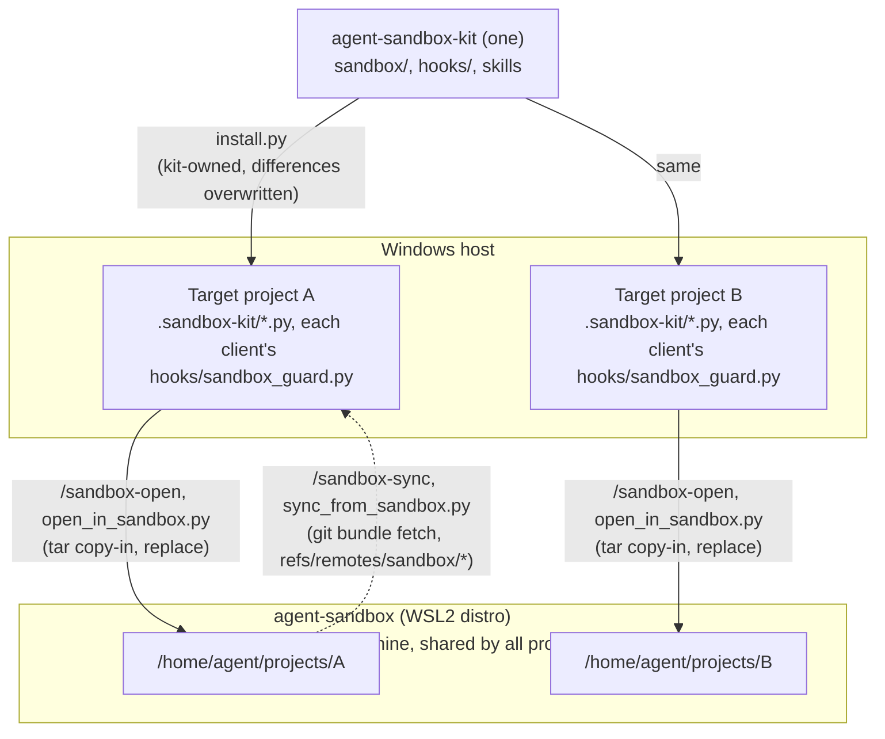

# Agent sandbox (dedicated WSL2 distro)

[日本語](README.ja.md)

A set of tools for running AI agents (Claude Code / Codex CLI / Cursor / Antigravity)
inside a dedicated WSL2 distro isolated from the Windows host. The goal is that even when
an agent runs in auto-approve mode, any damage stays confined to the distro.

This directory (`.sandbox-kit/`) is copied into multiple projects by agent-sandbox-kit's
`install.py` (kit-owned; differences are overwritten with the kit version). However, the
WSL2 distro it operates on (`agent-sandbox`) remains **a single shared environment per
machine**: running `/sandbox-setup` (a wrapper around `setup_sandbox.py`) from any
project's copy acts idempotently on the same distro. A separate distro is not created
per project.

## Skill quick reference

From Claude Code, Codex CLI, Cursor, and Antigravity, each operation is invoked via a
Skill (`/sandbox-*`). In other environments, run the corresponding `.sandbox-kit/*.py`
directly. See each section for details.

| Skill | Script | Purpose |
|---|---|---|
| `/sandbox-setup` | `setup_sandbox.py` | First-time setup (distro creation through provisioning; idempotent) |
| `/sandbox-open` | `open_in_sandbox.py` | Copy the project in via tar and launch the IDE (asks before replacing an existing copy) |
| `/sandbox-open-vc` | `reopen_in_sandbox.py` | Just reconnect the IDE to an already copied-in project (no re-copy) |
| `/sandbox-sync` | `sync_from_sandbox.py` | Fetch git history from the distro into the host's `refs/remotes/sandbox/*` (retrieve work) |
| `/sandbox-close` | `close_project_in_sandbox.py` | Sync, then remove only the current project (guarded) |
| (no Skill) | `tools/destroy_sandbox.py` | Guarded destruction of the whole distro. **Not distributed to target projects; run from the agent-sandbox-kit repository** |

Several scripts accept options such as `--dry-run`, `--force`, and `--yes`, and
destructive operations (removal, destruction, replacement) prompt for confirmation.

## Overview: kit / target projects / sandbox

The relationship is asymmetric: **one agent-sandbox-kit, many target projects, and one
sandbox per machine** (inside the sandbox, each project gets its own subdirectory).



- **Kit → target projects**: copied into multiple projects by `install.py`. Kit-owned
  files (this directory, Skills, hooks) are overwritten with the kit's version whenever
  they differ.
- **Target project → sandbox**: `/sandbox-open` (a wrapper around `open_in_sandbox.py`)
  copies the project via tar into `/home/agent/projects/<name>` inside the distro.
  **Whichever target project you run it from, it acts on the same single distro**
  (a separate distro is not created per project).
- **Sandbox → target project**: `/sandbox-sync` (a wrapper around `sync_from_sandbox.py`)
  fetches the sandbox-side project's git history into the host repository's
  `refs/remotes/sandbox/*` (see "Retrieving work" below).

## Approach and scope of isolation

The IDE UI stays on the host (native Windows) and opens the project in the isolated
distro over a **Remote-SSH connection** (ProxyCommand via wsl.exe → sshd on localhost:2222
inside the distro).
Agents, shells, and tools all run inside the distro.

⚠️ The **WSL remote extension (`wsl+`) of VS Code-based IDEs cannot be used**: it assumes
it can read the Windows-side extension directory and server tarball through `/mnt/c`
(automount), so it always fails in an isolated distro that unmounts the host drives
(`Failed to translate 'c:\...'` → `wslServer.sh: not found`).
Connections therefore use Remote-SSH. setup_sandbox.py automatically prepares the key
and the `Host agent-sandbox` entry in `~/.ssh/config`.

| Item | Status |
|---|---|
| Host drives (C:/D:) | **Not visible** (automount itself is enabled, but a systemd unit unmounts all host drives on every boot) |
| Launching Windows executables | **Not possible** (`interop` disabled) |
| sudo / root | **Not given to agents** (with sudo, host drives could be remounted via drvfs, breaking isolation) |
| `\\wsl.localhost` share | **Available** (host → distro direction only. If an agent on the host side accidentally opens this path, sandbox_guard warns/blocks) |
| Network | **Unrestricted** (API calls, npm install, etc. pass through) |
| Second layer of defense | Since this is Linux, Claude Code / Codex built-in sandboxes can also be enabled |

**Limitations**:

- The network is fully open, so as long as credentials live in the distro, anything
  those credentials permit (git push, etc.) is also possible for the agent. Give tokens
  only the minimum necessary permissions.
- All WSL2 distros **share a single VM and kernel**. This is not a strong boundary
  against kernel-level vulnerabilities (not as strong as Hyper-V VM isolation). Treat it
  as protection against everyday runaway behavior and mistakes.
- The plan9 server backing the `\\wsl.localhost` share starts in tandem with the
  automount setting, so automount is left enabled and the host drives are unmounted by a
  systemd unit at boot (`sandbox-umount-host-drives`). For a very short time right after
  boot, the drives are mounted (ordering ensures the unmount runs before sshd; this is
  within the "everyday runaway behavior and mistakes" scope above).

## Setup (first time only)

```
/sandbox-setup                              # via Skill
python .sandbox-kit/setup_sandbox.py        # run the script directly
```

Automatically downloads the Ubuntu 24.04 rootfs → imports the `agent-sandbox` distro →
applies isolation settings (wsl.conf) → provisions (agent user / Node.js / claude /
codex). Re-running only reapplies the settings and provisioning (idempotent).

Then authenticate:

```
wsl -d agent-sandbox
$ claude          # paste the displayed URL into a browser on the host manually
$ codex login     # same
```

⚠️ With interop disabled, the browser does not open automatically. Copy the URL manually.

## Daily use

```
/sandbox-open [project path]                        # defaults to the current directory (via Skill)
python .sandbox-kit/open_in_sandbox.py [project path] # run the script directly
```

1. The project is copied via a tar stream into
   `/home/agent/projects/<name>` inside the distro
   (`node_modules`, `.venv`, and `__pycache__` are excluded)
2. The IDE launches with the `ssh-remote+agent-sandbox` remote
   (requires a **Remote-SSH extension**)
3. On first use, install the agent extension (Claude Code, etc.) on the remote side as
   needed ("Install in SSH: agent-sandbox" in the Extensions view)

### Choosing the IDE

Choose the IDE with `--ide` or the `AGENT_SANDBOX_IDE` environment variable
(default: `code`).

| `--ide` | Launch command | IDE |
|---|---|---|
| `code` | `code` | VS Code |
| `cursor` | `cursor` | Cursor |
| `antigravity` (alias `agy`) | `antigravity-ide` | Antigravity |

```
python .sandbox-kit/open_in_sandbox.py --ide cursor
setx AGENT_SANDBOX_IDE cursor        # to avoid specifying it every time (takes effect in new shells)
```

All are launched as `<command> --remote ssh-remote+agent-sandbox <path>`.
Each IDE must have a Remote-SSH-equivalent extension installed.

### Retrieving work

- **`/sandbox-sync` (sync_from_sandbox.py)**: from the host, retrieves the sandbox-side
  git history as a bundle via `wsl.exe` and fetches it into the host repository's
  `refs/remotes/sandbox/*`. Works even for local-only repositories without an origin
  remote, and never touches the host's working tree or current branch, so it is safe to
  re-run any number of times:

  ```
  /sandbox-sync                                   # fetch the project matching the current directory name (via Skill)
  python .sandbox-kit/sync_from_sandbox.py        # run the script directly
  git log sandbox/<branch>                        # inspect the fetched branch
  git merge sandbox/<branch>                       # merge if needed
  ```

- **git push**: for projects with an origin remote (GitHub, etc.), you can also push from
  inside the distro and pull on the host
- **Reverse copy**: `/sandbox-open --export <name> <dest>` or
  `python .sandbox-kit/open_in_sandbox.py --export <name> <dest>`
  (the destination directory must be empty; intended for backing up everything,
  including files outside git)
- **Explorer**: `\\wsl.localhost\agent-sandbox\home\agent\projects` can be browsed
  directly from the host (for viewing and pulling out individual files. Opening this UNC
  path with an agent on the host side triggers sandbox_guard's warning/block)

Install packages from the host side (agents have no sudo):

```
wsl -d agent-sandbox -u root -- apt-get install -y <package>
```

### Reopening after closing the IDE

To just reconnect to an already copied-in project, no re-copy is needed:

```
/sandbox-open-vc                                # reconnect to the project matching the current directory name (via Skill)
python .sandbox-kit/reopen_in_sandbox.py        # run the script directly (--ide also accepted)
```

Internally this just runs `<IDE> --remote ssh-remote+agent-sandbox /home/agent/projects/<name>`
and never touches the contents of the existing copy.

You can also re-run `/sandbox-open` (`open_in_sandbox.py`), but if a copy already exists
it asks "Replace?" (aborting with `N`/Enter leaves the contents intact). If you only
want to reconnect without the prompt, the reopen commands above are quicker.

⚠️ Re-copying **replaces the existing copy entirely** (rm -rf + copy), so unpushed work
inside the distro is lost. Retrieve it with `/sandbox-sync` before replacing.

If the distro itself is stopped, wake it first with `wsl -d agent-sandbox`
(systemd is enabled, so it keeps running afterward).

## Closing a project (removing just one project)

To clean up a single finished project without destroying the whole distro, use
`/sandbox-close` (a wrapper around `close_project_in_sandbox.py`):

```
/sandbox-close                                          # close the project matching the current directory name (via Skill)
python .sandbox-kit/close_project_in_sandbox.py         # run the script directly
```

1. Retrieves git history into `refs/remotes/sandbox/*` via the same path as
   `/sandbox-sync` (sync_from_sandbox.py) (by default, aborts if retrieval fails;
   continue with `--force` only when you know retrieval is unnecessary)
2. Warns if the host-side working tree has uncommitted changes (these changes are not
   retrieved and are lost on removal)
3. Asks for final confirmation by typing the project name before removal (`--yes` when
   running the script)
4. Removes only `/home/agent/projects/<name>`. Never touches the distro itself
   (agent-sandbox) or other projects

⚠️ Because this is destructive, even when run through an agent (auto mode, etc.), the
Skill's instructions require confirming with the user in chat before execution
(see `sandbox-close`'s SKILL.md for details).

Since its target is limited to the current project, it is distributed to target
projects like the other `sandbox-*` Skills (sandbox-open, sandbox-sync, etc.).
By contrast, `tools/destroy_sandbox.py` (destroying the whole distro) is a destructive
script that operates on the machine-wide shared distro itself, so it is run only from
the agent-sandbox-kit repository to avoid unintentionally distributing it and adding
more entry points for mistakes.

## Caveats and pitfalls

- **`code .` cannot be used from inside the distro** (interop disabled). Always connect
  the IDE from the host side (`code --remote ssh-remote+agent-sandbox <path>` or the SSH
  target in Remote Explorer).
- **The WSL remote extension (`wsl+`) is incompatible with the isolation settings**
  (it assumes automount). Accidentally choosing "Open in WSL: agent-sandbox" fails with
  "VS Code Server for WSL closed unexpectedly". Use Remote-SSH.
- **WSL stops the distro about 15 seconds after its last client (wsl.exe) exits**
  (even with systemd enabled; sshd stops with it). The `~/.ssh/config` entry therefore
  connects through `ProxyCommand wsl.exe -d agent-sandbox ... nc localhost 2222` instead of
  going to localhost:2222 directly. Each connection starts the distro, and it stays up
  while connected. Entries created by older versions of setup_sandbox.py (without
  ProxyCommand) fail with `Connection refused`, or with `closed by remote host` mid-connection,
  once the distro stops. open_in_sandbox.py / reopen_in_sandbox.py (and setup_sandbox.py)
  append the ProxyCommand automatically before launching the IDE.
- **wsl.exe output is UTF-16LE**. Set `WSL_UTF8=1` when calling it from scripts
  (the scripts in this directory already do).
- **Line endings**: files copied from Windows keep CRLF. If that matters, set
  `git config core.autocrlf input` inside the distro.
- **Antigravity**: installation steps for a standalone CLI are unconfirmed, so
  provision.sh contains only a placeholder (to be filled in once known). Since it is a
  VS Code-based IDE, connecting to this distro via the IDE's Remote-SSH is possible.
- **`/sandbox-sync` (sync_from_sandbox.py) writes only to `refs/remotes/sandbox/*`** by
  design (never touches the host's working tree or current branch). Merge or discard
  fetched work with ordinary git operations on the host.

## Second layer: combining with Claude Code's built-in sandbox

Since the distro is Linux, Claude Code's OS-level sandbox (bubblewrap-based) is
available. Adding the following to `.claude/settings.json` in a project inside the
distro further confines Bash execution:

```json
{
  "sandbox": { "enabled": true }
}
```

## Host-side guard: warning/blocking when accidentally opened on the host

Opening a folder inside the sandbox directly with an IDE / agent **on the host side**
(via an SSHFS mount or `\\wsl.localhost`) runs the agent with the host Windows
permissions, defeating the isolation. `install.py` places hooks that detect this
**only in target projects** (not in user-global settings).

| Client | Hook file | Registered in | Behavior |
|---|---|---|---|
| Claude Code | `.claude/hooks/sandbox_guard.py` | `.claude/settings.json` (SessionStart / UserPromptSubmit) | Warns at start, **blocks** prompt submission |
| Codex CLI | `.codex/hooks/sandbox_guard.py` | `.codex/hooks.json` (SessionStart / UserPromptSubmit) | Warns at start, **blocks** prompt submission |
| Cursor | `.cursor/hooks/sandbox_guard.py` | `.cursor/hooks.json` (sessionStart / beforeSubmitPrompt) | Warns the agent at start, **blocks** prompt submission |
| Antigravity | `.agents/hooks/sandbox_guard.py` | `.agents/hooks.json` (PreInvocation / PreToolUse) | Injects a warning before model invocation and **denies all tool execution** (there is no event that can block prompt submission) |

- Detection logic lives in `_sandbox_guard_core.py` in each hook directory (shared by
  all clients)
- Projects are copied into the sandbox together with their hooks, so the hooks also
  take effect if the copied-in project is accidentally opened on the host side
- Detection methods: ① `\\wsl.localhost\agent-sandbox` / `\\wsl$\...` paths,
  ② SSHFS-Win UNC paths (`\\sshfs\agent@localhost!2222`, etc.) and mapped drives,
  ③ ancestor search for the marker file `.agent-sandbox` (placed inside the distro by
  provision.sh as root-owned + immutable; works regardless of mount method)
- For warnings only, remove the blocking event's entry from each registration file
  (Claude Code / Codex: `UserPromptSubmit`, Cursor: `beforeSubmitPrompt`,
  Antigravity: `PreToolUse`)
- **Does nothing outside Windows**: when correctly opened via Remote-SSH, the agent
  inside the distro runs the hook, but it exits immediately on Linux (no false positives)
- Marker detection takes effect after re-running provisioning (`/sandbox-setup`,
  `setup_sandbox.py`). UNC / SSHFS pattern detection works even before that

Per-client notes:

- **Codex CLI**: project hooks are loaded only when the `.codex/` layer is trusted, and
  each hook definition must be approved with `/hooks` (re-approval when a definition
  changes). `.codex/hooks.json` contains absolute hook paths, so do not share it across
  machines.
- **Cursor**: `.cursor/hooks.json` runs only in trusted workspaces.
  Cursor also loads `.claude/skills/` and Claude Code hooks for compatibility, so in
  projects with both Claude Code and Cursor enabled, Skills may appear twice and hooks
  may run twice. In that case, narrow it down to one with `install.py --clients`.
- **Antigravity**: `.agents/hooks.json` contains absolute hook paths, so do not share it
  across machines.

⚠️ **No guard without a sandbox**: these hooks only detect the case where "a project
copied into the sandbox was accidentally opened on the host side". In ordinary project
folders where the sandbox has not been set up or is not used, `is_sandbox_path`
(detection conditions: any of ①–③ above) is always False, so the hook returns
immediately and never warns or blocks.
In other words, it is not a mechanism for protecting environments that do not use the
sandbox. The only line of defense against an agent in auto-approve mode is the sandbox
itself (the isolated WSL2 distro); this guard is merely after-the-fact detection for
when that isolation is accidentally bypassed.

## File layout

```
.sandbox-kit/
├── README.md              ← this file
├── README.ja.md           ← Japanese version of this file
├── setup_sandbox.py       ← first-time setup (idempotent, re-runnable)
├── provision.sh           ← provisioning inside the distro (run automatically by setup)
├── wsl.conf               ← isolation settings template (placed at /etc/wsl.conf)
├── open_in_sandbox.py     ← copy project in / out (--export) + launch IDE
├── sync_from_sandbox.py   ← retrieve work (git bundle fetch → refs/remotes/sandbox/*)
├── reopen_in_sandbox.py   ← just reconnect the IDE to a copied-in project (no re-copy)
└── close_project_in_sandbox.py ← sync, then remove just one project (guarded)
```

## Destroying and recreating the distro

⚠️ The distro is **shared by all projects**. A bare `wsl --unregister` deletes it
immediately without confirmation, losing all unpushed work under `/home/agent/projects`
along with authentication state. Always destroy it with the guarded script:

```
python <agent-sandbox-kit>/tools/destroy_sandbox.py                        # check git state, then destroy
python <agent-sandbox-kit>/tools/destroy_sandbox.py --export-first <dest>  # back up all projects, then destroy
/sandbox-setup                                                            # recreate (authentication required again)
python .sandbox-kit/setup_sandbox.py                                      # run the script directly
```

- If any project has uncommitted / unpushed changes or is not under git, lists them and
  refuses (recommended: retrieve via push and re-run. To force it knowingly, use `--force`)
- Asks for final confirmation by typing the distro name before execution (`--yes` when
  running the script)
- Operating principle: **the distro is a disposable compute environment; persistence is
  via git push only**. As long as you follow this principle, destroying it is always safe

**No need to destroy the distro if only a specific project is broken, needs recreating,
or needs cleaning up**: to remove it safely after retrieving work, use `/sandbox-close`
(see "Closing a project" above). If retrieval is unnecessary and you just want to
recreate it, a direct `rm -rf` is fine too:

```
wsl -d agent-sandbox -- rm -rf /home/agent/projects/<name>
/sandbox-open <project path>                         # re-copy (via Skill)
python .sandbox-kit/open_in_sandbox.py <project path> # run the script directly
```
